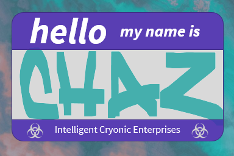

# Hello, CHaZ

#### Cyborgs, Humans, and Zombies

### Description

A simple game where the player controls pawns that represent humans that are trapped in cryonic, sleeping pods. The humans are in danger! There are other pods in the room that have minds of their own. The pods are controlled by Cyborgs and Zombies. These human-hybrids attack the humans and each other in very different ways.

The Cyborgs inject nanites into any pod that comes close enough to them. These nanites will continue to make repairs until there's very little human left. The humans will become cold, cybernetic machines.
Zombies do the opposite. They will attack any pod near them, dealing damage until the zombie horde gains another member, by turning the human into one of them. There is a sweet spot, though, where humans can still be considered human. If enough damage is done to the cyborg pods, they can once again become human. And the same is true for zombies that receive enough healing.

### Game Play

https://hello-chaz.herokuapp.com/users/enlist

### Technology & Tools

          

### Future Plans

- automated chat screen that guides player with hints and clues
- animated pawns that resemble spider-like cryo pods
- ability to switch teams and play as a cyborg or a zombie
- multi-player functionality through competing factions and cooperative team-ups
- build out more robust and interactive instruction manual
